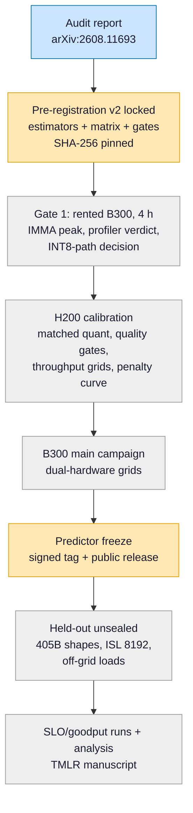

# When Equal Bytes Meet Unequal Tensor Cores: Measuring Quantization-Format Crossovers on H200 and B300


[](https://arxiv.org/abs/2608.11693)

> Reproducibility companion for the audit report **"Spec Sheets Are Not Kernels: An ISA- and Source-Level Audit of INT8 Availability on NVIDIA Blackwell Ultra"** ([arXiv:2608.11693](https://arxiv.org/abs/2608.11693)), and the pre-registration home of the companion measurement study **"When Equal Bytes Meet Unequal Tensor Cores"** (in progress). The question behind both: INT8 and FP8 occupy exactly one byte per value, yet B300 gives them a 30:1 dense-compute ratio — so *where does the throughput crossover sit, and what must you measure to predict it?*

## TL;DR

The audit traced INT8's withdrawal on B300 through four layers of the stack, every claim pinned to an official document, a source commit, or a released image digest:

| Layer | Finding | Pinned evidence |
| --- | --- | --- |
| Silicon | FP8:INT8 dense ratio ≈ 30:1 (H200 and B200 are both 1:1) | Blackwell Ultra Technical Brief, Table 3 |
| ISA | `tcgen05.mma .kind::i8` never exposed on `sm_103` | PTX ISA 9.3 |
| Kernel library | SM100 INT8 UMMA excluded for the `103a` arch family | CUTLASS generator source |
| Serving | INT8-W8A8 fails at **first forward**, not at load | vLLM dispatch source + pinned image |

This repository holds the **pre-registered protocol** for the measurement study that follows the audit: estimators, their acceptance tests, the design matrix, quality gates, and a scripted Gate-1 runbook — all locked by SHA-256 **before any target-hardware data existed** (tag [`prereg-v2-locked`](../../releases/tag/prereg-v2-locked), public server-side timestamp).

* * *

## Finding 1 — The withdrawal is coherent across four layers

No single layer's documentation announces it. The spec sheet still lists INT8; the serving engines still list INT8 quantization as supported. Only reading the four layers *together* — spec ratios, ISA target lists, kernel-generator guards, dispatch tables — reveals a coordinated de-prioritization. That is why the audit exists as a paper rather than a changelog note. (§III–§V of the paper.)

## Finding 2 — The failure is silent until first forward

An INT8-W8A8 checkpoint on B300 passes download, conversion, and engine load; the error surfaces only at the first inference call. For capacity planning this is the worst failure position: the cost is paid before the incompatibility is visible. (§V.)

## Finding 3 — Kernel-name checks give false negatives (the honest part)

The obvious way to verify "native INT8 execution" on `sm_103` — grep profiler output for fifth-generation tensor-core kernel names — is **wrong**: the PTX ISA never exposes those instructions for INT8 on that target, so a genuinely native INT8 execution cannot produce them. The reliable criterion is a nonzero `sm__inst_executed_pipe_tensor_op_imma.sum` counter in Nsight Compute. The Gate-1 runbook builds its verdict on the counter, validated on known-answer hardware (`sm_89`, measured 688.5 INT8 TOPS ≈ 100% of spec). (§VI; `reproducibility/gate1_runbook/ncu_verdict.sh`.)

* * *

## The measurement study (pre-registered, in progress)

Format selection is framed as a policy problem: π: (phase, load regime) → (format, config), minimizing GPU-seconds per token subject to SLO and quality gates. The baselines are **nested policy classes** — Π₀ (one global format, the industry default) ⊂ Π₁ (per-phase) ⊂ Π₂ (per-phase × regime) — so the study reports both the oracle value of enlarging the decision space and the regret of a cheap, mechanistic, hyperparameter-free predictor inside it. Four pre-registered hypotheses (H1 interaction, H2 crossover shift, H3 predictor vs. baselines on held-out points, H4 goodput under SLOs); estimator and protocol are locked in [`experiment/preregistration.md`](experiment/preregistration.md).



## Stage-by-stage

| Stage / file | Role | Inputs → outputs |
| --- | --- | --- |
| `experiment/preregistration.md` | Locked protocol: hypotheses, held-out splits, baselines, metrics, tie/censoring rules, amendment governance | — (normative) |
| `experiment/config_matrix.csv` | Design matrix: 26 experiments across hardware × format × phase × regime | matrix → 14,451 run specs |
| `experiment/harness/gen_sweep.py` | Deterministic sweep expander | matrix → `sweeps/*.jsonl` |
| `experiment/harness/changepoint.py` | Crossover / knee estimators: paired block bootstrap, censored-draws-as-±inf CIs, multiple-crossing reporting, penalty propagation | median curves → estimates + CIs |
| `experiment/harness/validate_synthetic.py` | Acceptance suite: 19 pre-stated criteria over real grid geometries and hard scenarios | synthetic truth → PASS/FAIL |
| `experiment/harness/quality_gates.py` | PPL / token-agreement / needle gates vs. a BF16 reference (thresholds pre-registered) | model + pinned dataset → gate verdicts |
| `reproducibility/gate1_runbook/` | Scripted 4-hour B300 session with GO/NO-GO decision tree; `imma_peak.cu`, `cublaslt_int8_probe.cu`, `ncu_verdict.sh` | rented GPU → Gate-1 verdict |
| `references/claim_source_ledger.csv` | Every factual claim with source, access date, verification status | — (audit trail) |

## Repository layout

```
experiment/
  preregistration.md          locked 2026-08-12 (tag prereg-v2-locked)
  config_matrix.csv           26 experiments
  harness/
    changepoint.py            estimators (pure stdlib)
    validate_synthetic.py     19-criteria acceptance suite (pure stdlib)
    quality_gates.py          PPL / agreement / needle gates
    gen_sweep.py              matrix -> run specs
    qwen3_32b_config.json     pinned architecture parameters
reproducibility/
  gate1_runbook/              scripted B300 Gate-1 procedure
  synthetic_validation_2026-08-12.log
  environment_manifest_template.yaml
  run_manifest_template.yaml
references/
  claim_source_ledger.csv
```

## Reproduce (fast — CPU, no GPU)

The estimator validation is pure standard-library Python and runs on any machine:

```bash
python3 experiment/harness/validate_synthetic.py
```

Expected: per-scenario metrics followed by `ACCEPT <scenario>: PASS` for all 19 criteria and `OVERALL: PASS` (~10–20 min on a laptop; the archived log from the locked run is in `reproducibility/`). The suite covers the real grid geometries (6/9/13-point, 5–7 repeats, σ up to 0.15) and the hard cases: near-tangent curves at the resolution limit, double crossings, shared block effects, penalty-uncertainty propagation, censored near-edge crossovers, and pure power laws that must *not* yield a knee.

## Pinned environments

| Component | Pin |
| --- | --- |
| vLLM serving image | `vllm/vllm-openai@sha256:0a51ea5b…` (digest, not tag) |
| CUDA build image | `nvidia/cuda:13.0.0-devel-ubuntu24.04` |
| Parent model | `Qwen/Qwen3-32B` @ `9216db5781bf…` |
| Quality-gate dataset | `Salesforce/wikitext` (`wikitext-2-raw-v1`, test) @ revision `b08601e0…` |
| Positive-control hardware | `sm_89` (RTX 4090): IMMA counter discriminates imma vs. hmma; 688.5 INT8 TOPS ≈ spec |

## What is *not* in this repository (by design)

- **No performance measurements yet.** The protocol is public *before* the data on purpose; measurements land here as they are produced, after the pre-registered gates they belong to.
- **No model weights or checkpoints** (`.gitignore` enforces this).
- **No internal planning documents** (budgets, vendor negotiations, decision logs) — only what a reader needs to *reproduce or audit*.
- The audit paper's LaTeX source lives with the arXiv submission, not here.

## Map to the papers

| Repo artifact | Audit paper (arXiv:2608.11693) | Measurement study (in progress) |
| --- | --- | --- |
| `claim_source_ledger.csv` | every §III–§V claim | carried forward |
| `gate1_runbook/ncu_verdict.sh` | §VI detection pitfall | Gate-1 verdict criterion |
| `preregistration.md` | — | protocol for H1–H4 |
| `changepoint.py` + validation log | — | estimator + its evidence |
| `quality_gates.py` | — | §7 quality gates |

## Citation

```bibtex
@misc{chen2026specsheets,
  title  = {Spec Sheets Are Not Kernels: An ISA- and Source-Level Audit
            of INT8 Availability on NVIDIA Blackwell Ultra},
  author = {Chen, Teng-Ruei},
  year   = {2026},
  eprint = {2608.11693},
  archivePrefix = {arXiv},
  primaryClass  = {cs.AR}
}
```

A citation entry for the measurement study will be added when it is released.

## License

Code is released under [MIT](LICENSE-CODE). Documents (pre-registration, runbook, ledger) are CC BY 4.0.
